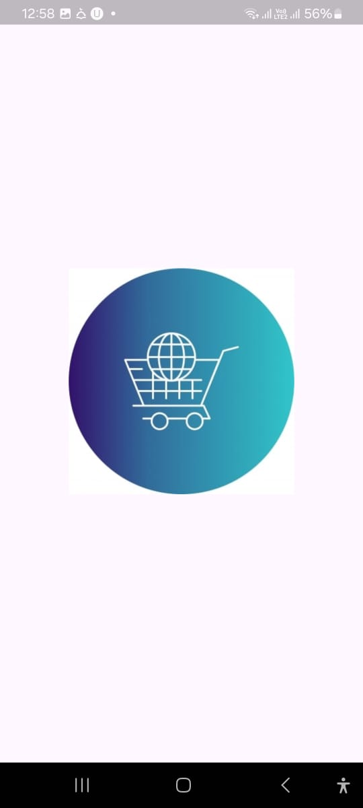
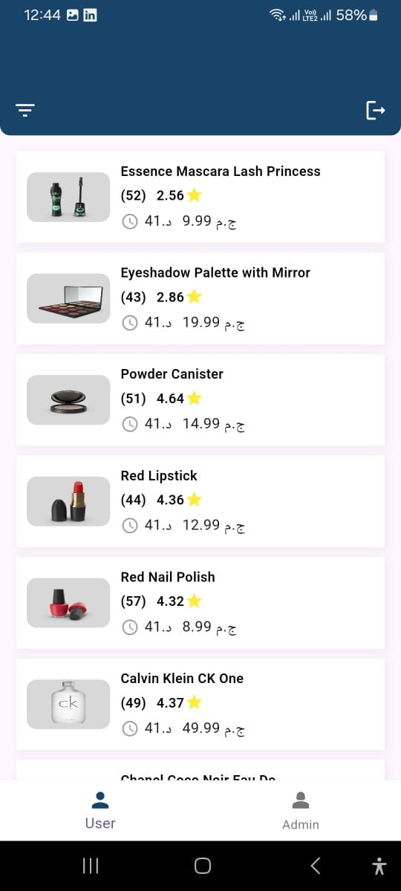
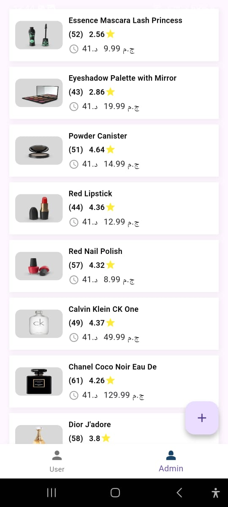
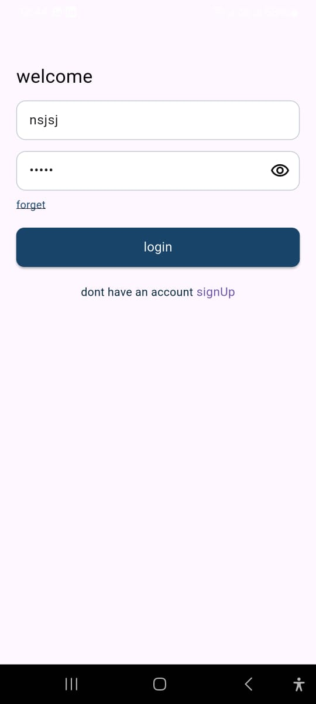
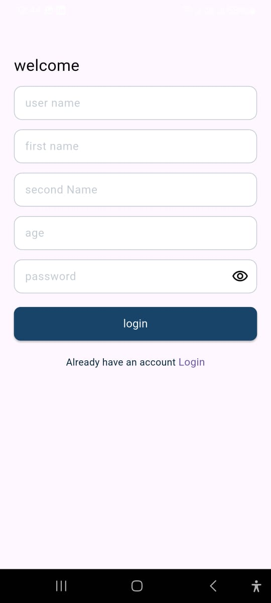
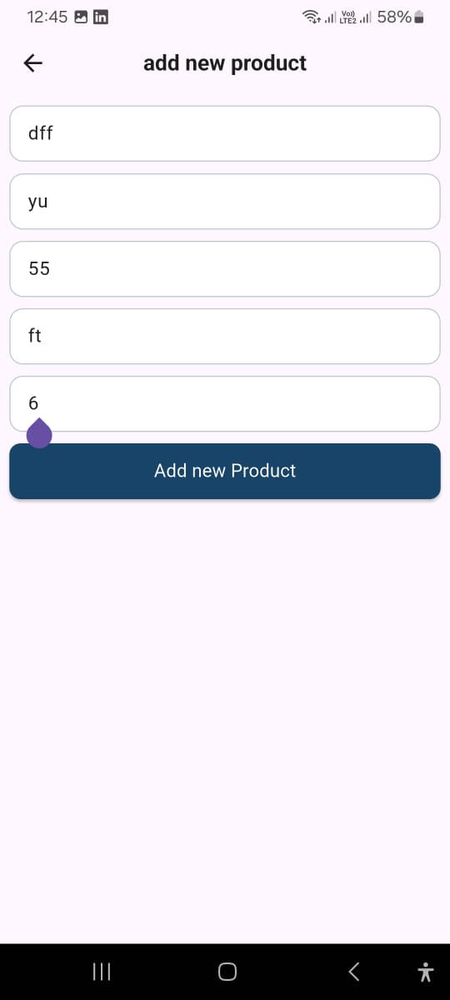
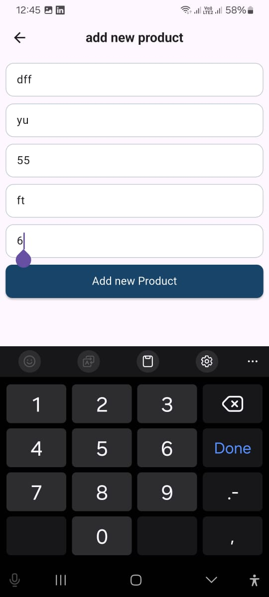
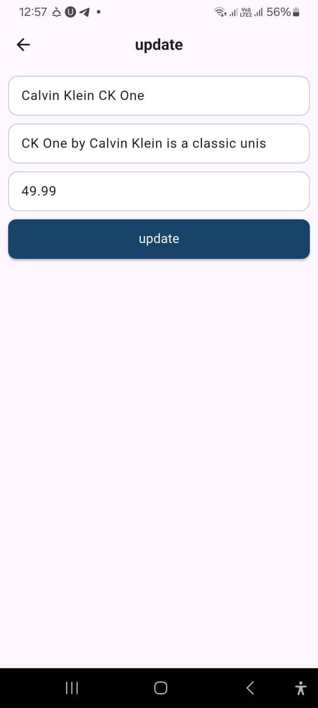
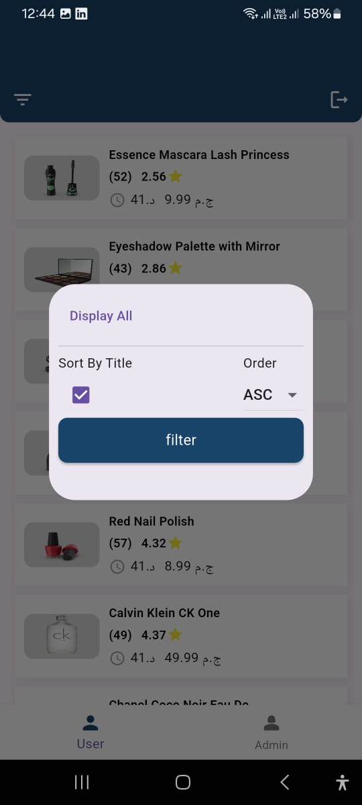

# 🛍️ Flutter E-Commerce App – SB Technical Task

This is a fully functional Flutter e-commerce application developed as part of the technical assessment for SB Company. It demonstrates real-world Flutter development with clean architecture, state management using Cubit, REST API integration, and role-based access control.

---

## 🚀 Features

### 🔐 Authentication & Authorization
- User registration, login, logout with JWT token.
- Role-based access control (Admin & User).
- Token storage using SharedPreferences.
- Auth flow managed with Cubit.

### 📡 REST API Integration
- Full CRUD for products.
- API integration using Dio with interceptors.
- Handles loading, success, and error states.

### 🧱 Data Models & Persistence
- Models: `User`, `Product`, `Category`, `Order`.
- JSON parsing with `manual JSON parsing`.
- Persistent storage using Hive and SharedPreferences.

### 🖼️ UI/UX & Product Listing
- Product list with pagination and pull-to-refresh.
- Filtering and sorting capabilities.
- Optimized list rendering with `ListView.builder`.

### 🛠️ Admin Panel (Bonus)
- Admin users can create, update, delete products.
- UI elements conditionally rendered by role.
- Navigation via BottomNavigationBar.

### 🧪 Testing
- Unit tests for business logic (e.g., login, product creation).
- Widget tests for key UI flows.
- Mocked API responses using `mockito`.

---

## 📂 Project Structure

```bash
lib/
├── core/
│   ├── network/
│   ├── apis/
│   ├── storage/
│   ├── routes/
├── features/
│   ├── auth/
│   ├── product/
│   ├── roles/
│   ├── admin/
├── shared/
│   └── widgets/
└── main.dart

📦 Dependencies
flutter_bloc (Cubit)

dio with interceptors && http

hive && hive_flutter

shared_preferences && flutter_secure_storage

mockito (testing)

get_it (dependency injection)

flutter_screenutil (responsive ui)

📦 ScreenShots
















